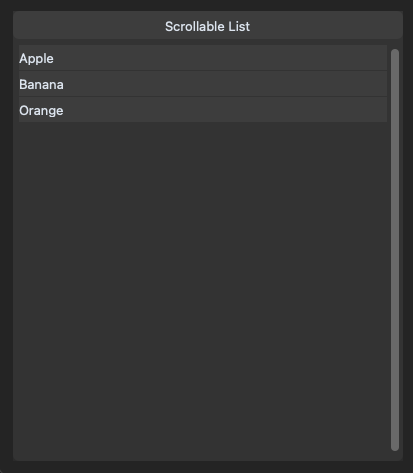

# CTkScrollingList - Implementation of a list control using CustomTkinter's scrolling frame.

The CTkScrollingList is a general purpose list using CustomTkinter's scrolling frame.
It can display items of any kind that adhere to the CTkScrollingListItemProtocol.

The CTkScrollingList provides method to add, update and delete items.

The CTkScrollingList requires two callback funtions.
One will be invoked when the list want to create a new list item: list_item_request_callback
One will be invoked to notify that a list item has been selected: list_item_selected_callback

There is an example implementation in example.py

Installation

`pip install git+ssh://git@github.com/Barrowcroft/scrolling_list.git`

or

`uv add git+https://git@github.com/barrowcroft/scrolling_list.git`

# Screenshot

